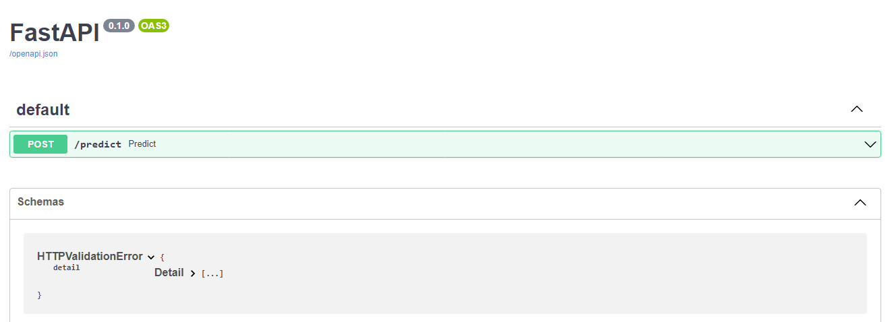
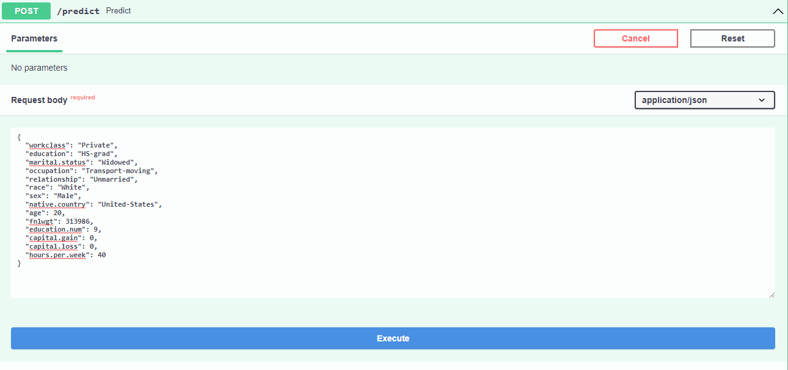
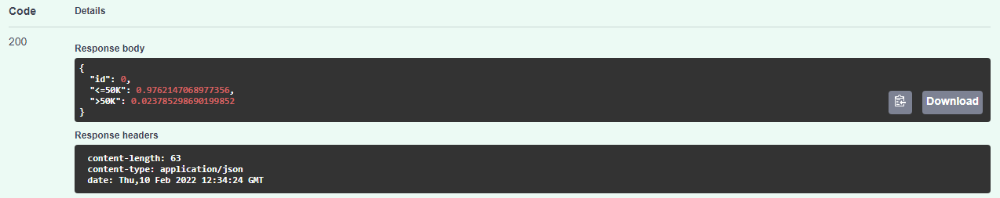

# Introduction to AutoXGB
The guide for AutoXGB which includes training and running web server.


AutoXGB is simple but effective AutoML tool to train model tabular dataset directly. The AutoXGB use [XGBoost](https://xgboost.readthedocs.io/en/stable/) for training the model, [Optuna](https://optuna.org/) for hyperparameters optimization and [FastAPI](https://fastapi.tiangolo.com/) to run web app. 

* auto train xgboost directly from CSV files
* auto tune xgboost using Optuna
* auto serve best xgboot model using FastAPI

```shell
pip install autoxgb
```
[](https://github.com/abhishekkrthakur/autoxgb)


## Dataset
The dataset is available at Kaggle: [Adult Census Income](https://www.kaggle.com/uciml/adult-census-income) under CC0: [Public Domain](https://creativecommons.org/publicdomain/zero/1.0/). It was extracted from the [1994 Census bureau database](http://www.census.gov/en.html) by Ronny Kohavi and Barry Becker (Data Mining and Visualization, Silicon Graphics).The prediction task is to determine whether a person makes over $50K a year.

## Training with CLI

Train the model in terminal using the `autoxgb train` command. The parameters are same as above.

```
autoxgb train \
 --train_filename binary_classification.csv \
 --output output \
```

## Web API
By using `autoxgb serve` on CLI you can run localy FastAPI server. 



### Input
We are going to use FastAPI GUI to run predictions on model by adding `/docs` at the end of the link. For example `172.3.167.43:39118/docs`
- workclass: "Private"
- education: "HS-grad"
- marital.status: "Widowed"
- occupation: "Transport-moving"
- relationship: "Unmarried"
- race: "White"
- sex: "Male"
- native.country: "United-States"
- age: 20
- fnlwgt: 313986
- education.num: 9
- capital.gain: 0
- capital.loss: 0
- hours.per.week: 40



### Outcome
The result is `<50k` with confidence of 97.6% and `>50k` with confidence of 2.3%.



